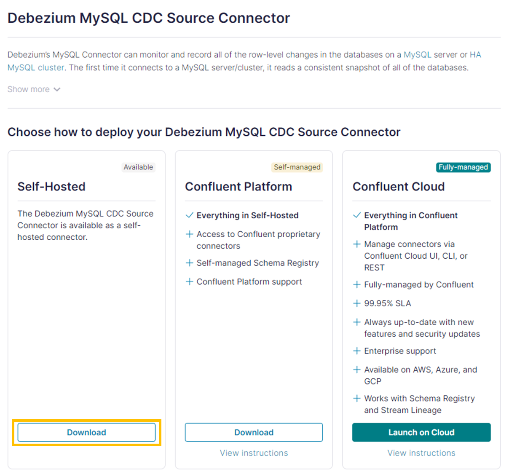
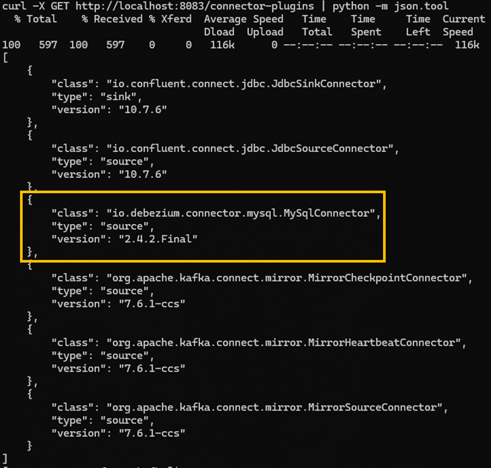
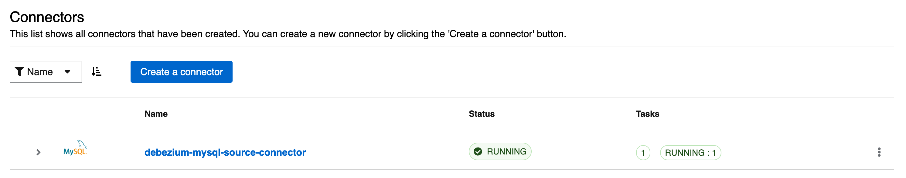
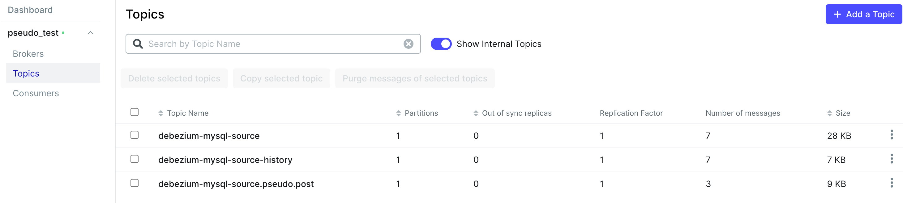

# Debezium Test

## Debezium MySQL Source Connector 설치 및 실행

- Debezium 공식 문서: [Debezium connector for MySQL](https://debezium.io/documentation/reference/stable/connectors/mysql.html)

### 1. 소스 커넥터 다운로드

- [Debezium MySQL CDC Source Connector](https://www.confluent.io/hub/debezium/debezium-connector-mysql)에서 소스 커넥터 다운로드



### 2. Kafka 컨테이너에 다운 받은 소스 커넥터 복사

1. 위에서 다운 받은 소스 커넥터의 압축을 해제한다.
2. Kafka 커넥트 설정에 정의된 `plugin.path` 하단에 소스 커넥터를 복사한다.
   - Kafka 커넥터 설정 파일 위치 (standalone mode): `etc/kafka/connect-standalone.properties`
   - Kafka 커넥터 설정 파일 위치 (distributed mode): `etc/kafka/connect-distributed.properties`
   - 기본 `plugin.path`: `/usr/share/java`

### 3. Kafka 커넥트 실행

카프카 컨테이너 내부에서 실행

**Standalone mode**

```bash
connect-standalone -daemon /etc/kafka/connect-standalone.properties
```

**실행 확인**

```bash
curl -X GET http://localhost:8083
```

**설치된 플러그인 확인**

```bash
curl -X GET http://localhost:8083/connector-plugins | python -m json.tool
```



## MySQL 설정

### 1. 유저 권한 설정

Debezium 소스 커넥터를 사용하기 위해서는 SELECT, RELOAD, SHOW DATABASES, REPLICATION SLAVE, REPLICATION 권한이 필요함

```sql
GRANT SELECT, RELOAD, SHOW DATABASES, REPLICATION SLAVE, REPLICATION CLIENT ON *.* TO '${MYSQL_USER}'@'%';
GRANT ALL PRIVILEGES ON *.* TO '${MYSQL_USER}'@'%';
FLUSH PRIVILEGES;
```

### 2. (optional) GTID 설정

[읽기 전용 스냅샷](https://debezium.io/documentation/reference/stable/connectors/mysql.html#mysql-read-only-incremental-snapshots)을 위한 설정으로 `my.cnf`에 GTID 관련 설정을 명시하거나 MySQL에서 직접 설정할 수 있음

**`my.cnf`에 명시**

도커 이미지 빌드 시 `/etc/mysql/my.cnf`에 복사

```
[mysqld]
gtid_mode=ON
enforce_gtid_consistency=ON
```

**MySQL 컨테이너 내부에서 직접 설정**

```sql
gtid_mode=ON;
enforce_gtid_consistency=ON;
show global variables like '%GTID%';
```

### 3. 테이블 생성

**post**

```sql
CREATE TABLE post (
    id          INT                                 NOT NULL PRIMARY KEY,
    file_path   VARCHAR(300)                        NOT NULL,
    create_time TIMESTAMP DEFAULT CURRENT_TIMESTAMP NOT NULL,
    update_time TIMESTAMP DEFAULT CURRENT_TIMESTAMP NOT NULL,
    constraint filePath_UNIQUE UNIQUE (file_path)
);
```

## 소스 커넥터 생성

자세한 커넥터 설정은 [Connector properties](https://debezium.io/documentation/reference/stable/connectors/mysql.html#mysql-connector-properties)에서 확인 가능

### 1. 소스 커넥터 생성

```bash
curl -X POST 'http://localhost:8083/connectors' \
--header 'Content-type: application/json' \
--data-raw '{
  "name": "debezium-mysql-source-connector",
  "config": {
    "connector.class": "io.debezium.connector.mysql.MySqlConnector",
    "tasks.max": "1",
    "database.hostname": "mysql",
    "database.port": "3306",
    "database.user": "pseudo",
    "database.password": "pseudo",
    "database.server.id": "18405",
    "topic.prefix": "debezium-mysql-source",
    "database.include.list": "pseudo",
    "schema.history.internal.kafka.topic": "debezium-mysql-source-history",
    "schema.history.internal.kafka.bootstrap.servers": "kafka-1:9092",
    "include.schema.changes": "true"
  }
}'
```

### 소스 커넥터 확인

```bash
curl -X GET http://localhost:8083/connectors
```

**debezium-ui**

생성된 커넥터 확인



**kafka-ui**

생성된 토픽 확인


